# 📈 TrendTrackr: An Agentic AI-Powered Dashboard

[](https://sentiment-analysis-agent-vfwc6va3wnvgqquitfkp5s.streamlit.app)

A sophisticated, AI-powered dashboard that demonstrates agent-to-agent communication and multi-component pipeline (MCP) design. The application analyzes sentiment from real-time news and Amazon product reviews, and includes interactive research modules on advanced tech topics.

---

## 🤖 Agentic AI Architecture

This application is built using a modular, agentic design pattern. The main `Home.py` script acts as an **Orchestrator**, which calls a series of specialized **Tools** (agents) to perform specific tasks. This approach, known as a Multi-Component Pipeline (MCP), makes the system more robust, maintainable, and scalable.

### Agent-to-Agent (A2A) Workflow

When a user initiates an analysis, the Orchestrator executes a pipeline, with the output of one agent becoming the input for the next. This flow is made visible in the UI using `st.status` to show which agent is currently active.

Here is the workflow for an Amazon Review Analysis:

```mermaid
graph TD
    A[User Input: ASIN] --> B{🤖 Orchestrator};
    B --> C[🔍 API Agent: tool_fetch_amazon_product];
    C --> D[🧠 Sentiment Agent: tool_analyze_sentiment];
    D --> E[☁️ Visualization Agent: tool_generate_wordcloud];
    E --> F[📊 UI: Display Results];
```



1.  **User Input:** The user provides an Amazon ASIN.
2.  **Orchestrator (`Home.py`):** Receives the request and begins the pipeline.
3.  **API Agent (`tool_fetch_amazon_product`):** Called by the orchestrator to fetch the product title and reviews from an external API.
4.  **Sentiment Agent (`tool_analyze_sentiment`):** Receives the reviews from the API Agent and performs sentiment analysis on the text.
5.  **Visualization Agent (`tool_generate_wordcloud`):** Receives the analyzed data and generates a word cloud image.
6.  **UI (`Home.py`):** The orchestrator displays the final results (dataframes, charts, images) in the Streamlit interface.

---

## ✨ Features

-   **Visible Agentic Workflow**: The UI uses an animated status box to show the active agent at each step of the analysis pipeline (e.g., `API Agent`, `Sentiment Agent`).
-   **Multi-Component Pipeline (MCP) Design**: The code is refactored into a clear "Orchestrator" and "Tools" structure, demonstrating a robust and scalable software pattern.
-   **Real-Time News Sentiment Analysis**: Fetches and analyzes the latest news headlines for any topic.
-   **Amazon Product Review Analysis**: Fetches and analyzes user reviews for any Amazon product ASIN.
-   **Interactive Research Modules**:
    -   **RDMA Simulation**: An interactive module that visually contrasts traditional TCP/IP data transfers with high-speed RDMA, demonstrating the concepts of kernel bypass and zero-copy for AI training.
    -   **CDN Paywall Simulation**: A simulation of Cloudflare's "Pay Per Crawl" mechanism, allowing users to experiment with different AI crawler bids.
-   **Advanced Sentiment Analysis**: Employs the VADER model to classify text as Positive, Negative, or Neutral.
-   **Rich Visualizations**: Generates interactive charts and word clouds to display results.
-   **Efficient Caching**: Uses Streamlit's caching to optimize performance and avoid redundant API calls.

---

## 🛠️ Tech Stack

-   **Framework**: Streamlit
-   **Architecture**: Agent-to-Agent (A2A), Multi-Component Pipeline (MCP)
-   **Data Sources**: NewsAPI.org, RapidAPI (for Amazon data)
-   **Sentiment Analysis**: VADER
-   **Visualizations**: Plotly Express, WordCloud, Matplotlib
-   **Core Libraries**: Pandas, Requests

---

## 🚀 Local Setup and Execution

1.  **Clone the Repository**
    ```bash
    git clone <your-repo-url>
    cd sentiment-analysis-agent
    ```

2.  **Create and Activate a Virtual Environment**
    ```bash
    python -m venv venv
    source venv/bin/activate  # On Windows, use `venv\Scripts\activate`
    ```

3.  **Install Dependencies**
    ```bash
    pip install -r requirements.txt
    ```

4.  **Set Up Your API Keys**
    - Create a file at `.streamlit/secrets.toml`.
    - Add your API keys to this file:
      ```toml
      NEWS_API_KEY = "your_news_api_key"
      RAPIDAPI_KEY = "your_rapidapi_key"
      ```

5.  **Run the Application**
    ```bash
    streamlit run Home.py
    ```
The application will now be running and accessible at `http://localhost:8501`.

---

## 👨‍💻 About the Creator

This project was developed by **Shivakant Dubey**.

Feel free to connect with me and follow my work:
🔗 [LinkedIn Profile](https://www.linkedin.com/in/shivapunit/)

---
